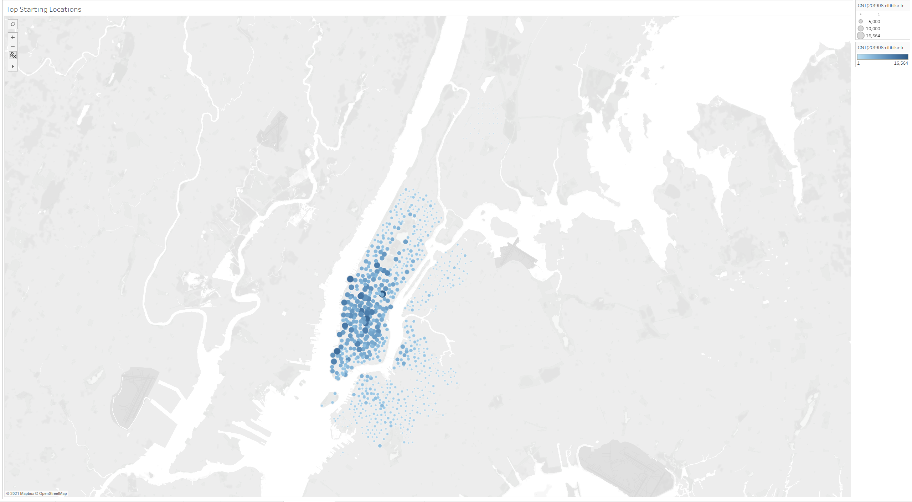

# bikesharing
## Overview
In this challenge we needed to gather data to show potential investors reasons a bikesharing company is a good idea in Des Moines. In order to prove this, we took the August citi bike data for New York City and used the data to make some visulations. We then use those visualtions too show the investors common questions and there solutions.
## Results

This graph shows us the time users checkout bikes for.

This graph shows us the time each gender checks a bike out for.

In this heatmap we can get a sense of what time of each day is busy or not busy.

In this heatmap we can see how many of each gender use our bikes for each hour of each day.

This heatmap allows us to see how manyu users are subscribed and which gender they are.

In this map we can find where the bikes are used the most, this can help gives us an idea of future expansions.

In this map we see where people usually end their trips.
## Summary
The challenge this week helps us have an idea of how a bikesharing company of our own may play out. Each one of our visualtions have a story to tell and can answer a number of questions. However I think having a visulation to look at how long none subscribed users take to ride the bike, to give us an idea as to how interested people are to trying out our service. Another visulation is looking at the age our subscribers are to have a good understanding of our target audience.
